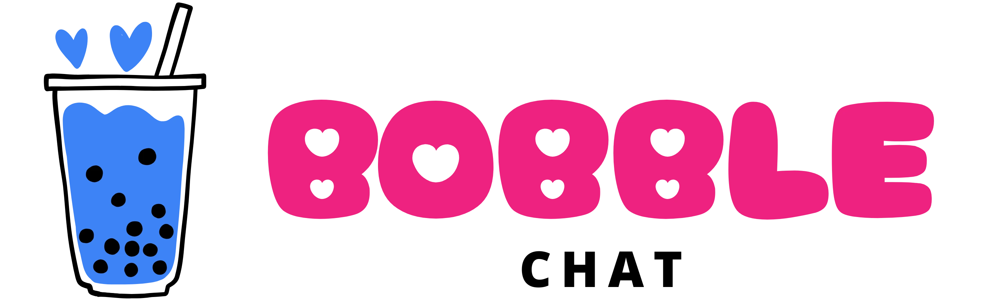

<div align="center">
  
  
  <h3>The Ultimate Real-time Communication Platform</h3>

  <p align="center">
    
    
    
    
  </p>

  <p align="center">
    <a href="https://rzp.io/rzp/bobblechat" target="_blank">
      
    </a>
  </p>
</div>

---

## 🚀 Overview

**BobbleChat** is a state-of-the-art, open-source real-time messaging application built for speed, transparency, and a premium user experience. It combines the power of **Next.js 15**, **Socket.IO**, and **Supabase** to deliver instant messaging with features you'd expect from modern platforms like WhatsApp or Telegram.

## ✨ Features

*   **Real-time Messaging**: Instant message delivery using Socket.IO.
*   **Message Status Indicators**:
    *   ✓ Sent (successfully reached the server)
    *   ✓✓ Delivered (receiver is online)
    *   ✓✓ (Green) Seen (receiver has read the message)
*   **Multimedia Sharing**: Seamless image sharing with high-performance WebP conversion.
*   **Voice & Video Calls**: High-quality WebRTC-based calling functionality.
*   **Global Sync**: Background message syncing and unread count badges.
*   **Advanced Controls**: Mute conversations, unsend messages, and full chat history management.
*   **Premium UI**: Sleek dark/light mode with glassmorphism and smooth micro-animations.

## 💻 Tech Stack

- **Frontend**: Next.js 15 (App Router), React, Tailwind CSS, Lucide React
- **Backend Real-time**: Express.js + Socket.IO
- **Database & Auth**: Supabase (PostgreSQL, Auth, Storage)
- **Signaling**: WebRTC for Audio/Video calls

## 🛠️ Getting Started

### 1. Prerequisites
- Node.js 18+
- pnpm or npm
- Supabase Project

### 2. Installation
```bash
# Clone the repository
git clone https://github.com/yourusername/BubbleChat.git
cd BubbleChat

# Install dependencies
pnpm install
```

### 3. Environment Setup
Create a `.env.local` file in the root:
```env
NEXT_PUBLIC_SUPABASE_URL=your_supabase_url
NEXT_PUBLIC_SUPABASE_ANON_KEY=your_supabase_anon_key
SUPABASE_SERVICE_ROLE_KEY=your_service_role_key
NEXT_PUBLIC_SOCKET_URL=http://localhost:3001
```

### 4. Running the App
```bash
# Start the Socket server (Terminal 1)
node server/server.js

# Start the Frontend (Terminal 2)
pnpm run dev
```

## 🌐 Deployment

For complete details on deploying to **Vercel** (Frontend) and **AWS EC2** (Socket Server), please refer to our [Deployment Guide](deployment.md).

## 🤝 Contribution

This is an **Open Source** project! We welcome contributions from developers of all skill levels.

1.  **Fork** the repository.
2.  Create your **Feature Branch** (`git checkout -b feature/AmazingFeature`).
3.  **Commit** your changes (`git commit -m 'Add some AmazingFeature'`).
4.  **Push** to the Branch (`git push origin feature/AmazingFeature`).
5.  Open a **Pull Request**.

## ☕ Support the Project

If you find this project helpful and want to support its continued development, feel free to buy me a coffee!

<div align="center">
  <a href="https://rzp.io/rzp/bobblechat" target="_blank">
    
  </a>
</div>

## 📝 License

Distributed under the MIT License. See `LICENSE` for more information.

---

<p align="center">Built with ❤️ by the BobbleChat Community</p>
